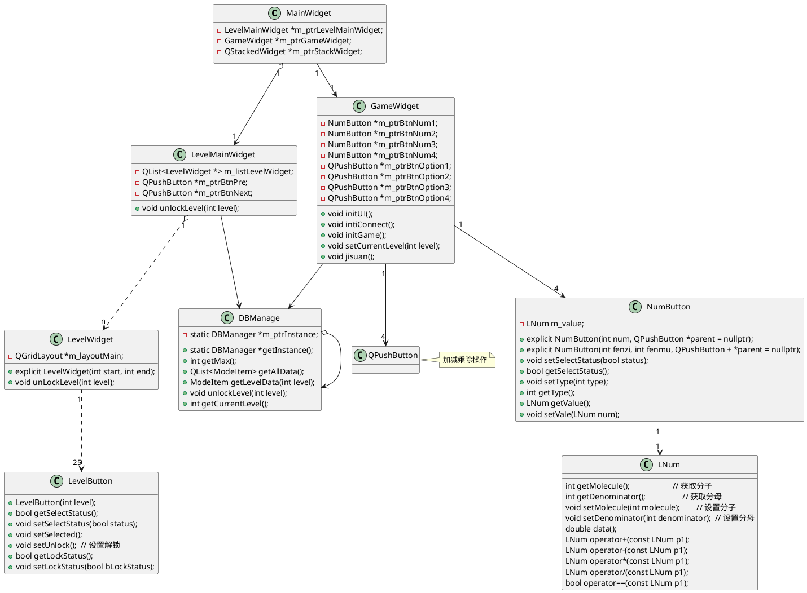
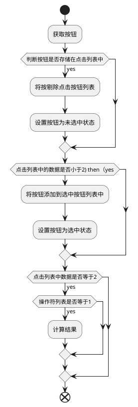
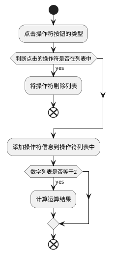

# 24点游戏设计

## 游戏介绍
   有关卡设置，24点的题库是根据算法计算出来的可以先查看文章
   玩家获取4张1-10点的牌，可以通过点击数字以及运算计算出最终的结果，如果结果等于24那么游戏获胜。
## 类关系设计



## 类详细说明
### MainWidget类
+ 主页面，使用m_ptrStackWidget切换游戏界面以及关卡界面。

### LevelMainWidget类
+ 关卡主页面类，由于关卡有多个，因此可能需要进行翻页，该类包含多个LevelWidget页面表示需要翻页。
+ m_ptrBtnPre:向上翻页按钮
+ m_ptrBtnNext: 向下翻页按钮
+ unlockLevel：解锁关卡UI，1.计算当前关卡在第几页int((level - 1) / 25);


### LevelWidget类
+ 关卡页面，一个levelWidget页面中包含25个关卡。
+ unlockLevel：解锁关卡UI，更新当前关卡的解锁状态。

### LevelButton类
+ 关卡按钮类，用于显示当前关卡的状态，以及关卡号码，点击按钮后显示对应的GameWidget

### NumButton类
+ 游戏关卡中数字按钮类，用于存储数字信息，以及设置按钮被选中。

### GameWidget类
+ 游戏界面类，从数据库中获取当前关卡游戏数据，将其内容展示到界面中。
+ 24点游戏的主要游戏逻辑。
+ 通过处理玩家的点击按钮事件获取计算数据以及计算操作符号，完成游戏计算逻辑。

### LNum类
+ 分数计算类，由于24点计算过程中可能出现分数计算，因此使用该类，重载操作符进行分数计算。


## 关键算法说明

计算24点是游戏的核心，游戏的玩法是点击“数字+运算符+数字计”或者点击“数字+数字+运算符”计算出最终结果。点击按钮的算法以及游戏获胜算法是游戏的关键。
存储点击状态主要由以下两个变量完成
```C++
typedef struct num_item_stu {
    LNum num = LNum(-1);
    int type = -1;  // 选中的按钮编号
    bool operator==(const num_item_stu &p)
    {
        return (this->num == p.num) && (this->type == p.type);
    }
    NumButton *btn;
} NumItem;

typedef struct option_item_stu {
    int option = -1;  // 操作符号 0:加，1：减，2：乘，3：除法
    int type = -1;    // 选中的按钮编号
} OptionItem;
// 存储点击的数字，注意数字的选中不能超过两个
QList<NumItem> m_listNumSelect;
// 存储点击的操作符, 操作符的选中不能超过1个
QList<OptionItem> m_listOptionSelect;
```

### 点击数字按钮
使用列表容器 QList<NumItem> m_listNumSelect; 记录用户选择数字按钮的内容。当点击两个字数字的时或者点击 操纵字符时，讲最后的展示结果。如果只有最后一个数字那么就判断是否获胜。
使用容器QList<OptionItem> m_listOptionSelect记录用户选择的操作服。，当点击两个字数字的时或者点击 操纵字符时，讲最后的展示结果。如果只有最后一个数字那么就判断是否获胜。
逻辑图如下：
大致逻辑如下：
1. 判断按钮是否被选中如果被选中那么剔除选哪种按钮列表
2. 判断选中数字列表中的数字是否为2，
3. 判断操作符列表中是否有选中的操作符，如果有那么计算结果。



### 点击操作符按钮
逻辑图如下图：




### 数字计算以及结果判断
逻辑如下：
1. 根据选择的数字以及操作符进行计算。
2. 隐藏第一个按钮。
3. 设置第二次选中的按钮的值为最终计算值
4. 修改按钮为未选中状态
5. 统计所有按钮的隐藏状态，如果只有一个按钮显示并且计算结果等于24那么游戏获胜，否则游戏失败
6. 如果游戏获胜那么解锁下一关卡，并且自动加载下一个关卡的数据。
代码逻辑如下：
```C++
void GameWidget::jisuan()
{
    LNum num =
        Tools::jisuan(m_listNumSelect.first().num, m_listNumSelect.last().num,
                      m_listOptionSelect.at(0).type);
    m_listNumSelect.first().btn->hide();
    m_listNumSelect.last().btn->setVale(num);
    m_listNumSelect.last().btn->setSelectStatus(false);
    m_listNumSelect.clear();
    m_listOptionSelect.clear();
    int s1 = m_ptrBtnNum1->isHidden() ? 0 : 1;
    int s2 = m_ptrBtnNum2->isHidden() ? 0 : 1;
    int s3 = m_ptrBtnNum3->isHidden() ? 0 : 1;
    int s4 = m_ptrBtnNum4->isHidden() ? 0 : 1;
    int s = s1 + s2 + s3 + s4;
    bool isWin = false;
    if (s == 1) {
        if (1 == s1 && m_ptrBtnNum1->getValue() == LNum(24)) {
            isWin = true;
        } else if (1 == s2 && m_ptrBtnNum2->getValue() == LNum(24)) {
            isWin = true;
        } else if (1 == s3 && m_ptrBtnNum3->getValue() == LNum(24)) {
            isWin = true;
        } else if (1 == s4 && m_ptrBtnNum4->getValue() == LNum(24)) {
            isWin = true;
        }
        if (isWin) {
            QMessageBox::information(this, "恭喜", "通关");
            m_iCurrentLevel++;
            DBManager::getInstance()->unlockLevel(m_iCurrentLevel);
            initGame();
            emit sigUnlockLevel(m_iCurrentLevel);
        } else {
            QMessageBox::information(this, "提示", "重新来吧");
        }
    }
}


LNum Tools::jisuan(LNum num1, LNum num2, int x)
{
    switch (x) {
        case 0:
            return num1 + num2;
        case 1:
            return num1 - num2;
        case 2:
            return num1 * num2;
        case 3:
            return num1 / num2;
    }
    return LNum(0);
}

```
