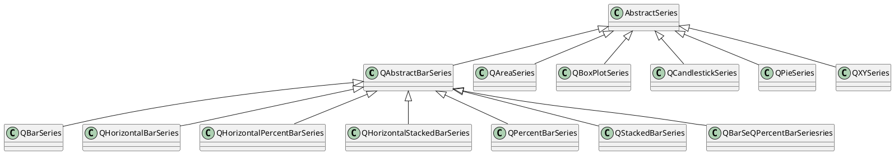
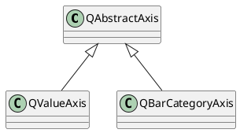

# QChart类说明

```plantuml
@startuml
class QAbstractBarSeries
class QBarSeries
class QHorizontalBarSeries
class QHorizontalPercentBarSeries
class QHorizontalStackedBarSeries
class QPercentBarSeries
class QStackedBarSeries

class AbstractSeries
class QAbstractBarSeries
class QAreaSeries 
class QBoxPlotSeries
class QCandlestickSeries 
class QPieSeries
class QXYSeries

AbstractSeries <|-- QAbstractBarSeries
AbstractSeries  <|-- QAreaSeries
AbstractSeries  <|-- QBoxPlotSeries
AbstractSeries  <|-- QCandlestickSeries
AbstractSeries  <|-- QPieSeries
AbstractSeries  <|-- QXYSeries


QAbstractBarSeries <|--  QBarSeries
QAbstractBarSeries <|--  QHorizontalBarSeries
QAbstractBarSeries <|--  QHorizontalPercentBarSeries
QAbstractBarSeries <|--  QHorizontalStackedBarSeries
QAbstractBarSeries <|--  QBarSeQPercentBarSeriesries
QAbstractBarSeries <|--  QPercentBarSeries
QAbstractBarSeries <|--  QStackedBarSeries
@enduml
```

```plantuml
@startuml
class QAbstractAxis
class QValueAxis
class QBarCategoryAxis

QAbstractAxis <|--  QValueAxis
QAbstractAxis <|--  QBarCategoryAxis
@enduml
```
