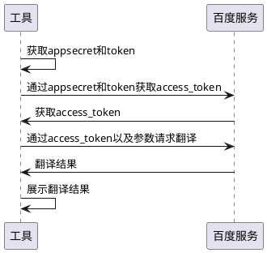

# 在线翻译工具

## 流程图

```plantuml
@startuml
工具 -> 工具:获取appsecret和token
工具 -> 百度服务: 通过appsecret和token获取access_token
百度服务 -> 工具: 获取access_token 
工具 -> 百度服务: 通过access_token以及参数请求翻译
百度服务 -> 工具: 翻译结果
工具 -> 工具: 展示翻译结果
@enduml

```
