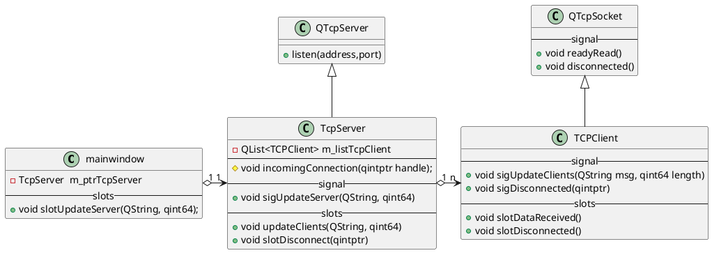
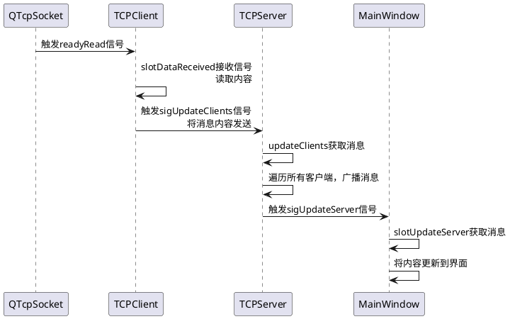
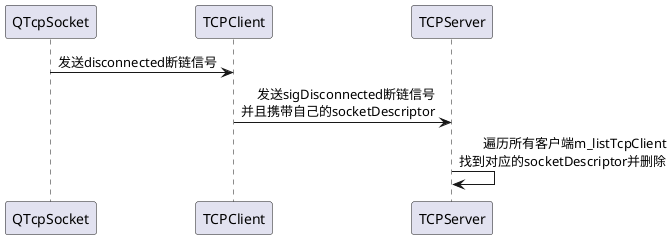
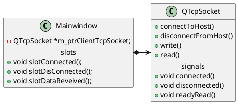

# TcpServer服务器

```plantuml

@startuml
class mainwindow{
    - TcpServer  m_ptrTcpServer
    -- slots --
    + void slotUpdateServer(QString, qint64);
}
class QTcpServer{
   + listen(address,port)
}
class QTcpSocket{
    --signal--
   + void readyRead()
   + void disconnected()
}
class TcpServer{
    - QList<TCPClient> m_listTcpClient
    --
    # void incomingConnection(qintptr handle);
    --signal--
     + void sigUpdateServer(QString, qint64)
    --slots--
     + void updateClients(QString, qint64)
     + void slotDisconnect(qintptr)
}
class TCPClient{
    --signal--
    + void sigUpdateClients(QString msg, qint64 length)
    + void sigDisconnected(qintptr)
    --slots--
    + void slotDataReceived()
    + void slotDisconnected()
}
 mainwindow "1" o-> "1"  TcpServer
 QTcpServer  <|-- TcpServer
 QTcpSocket  <|-- TCPClient
 TcpServer  "1" o->  "n"  TCPClient
@enduml

```

```plantuml
@startuml
QTcpSocket -> TCPClient:触发readyRead信号
TCPClient -> TCPClient:slotDataReceived接收信号\r读取内容
TCPClient -> TCPServer:触发sigUpdateClients信号\r将消息内容发送
TCPServer ->TCPServer:updateClients获取消息
TCPServer -> TCPServer:遍历所有客户端，广播消息
TCPServer -> MainWindow:触发sigUpdateServer信号
MainWindow -> MainWindow:slotUpdateServer获取消息
MainWindow ->MainWindow:将内容更新到界面
@enduml
```

```plantuml
@startuml
QTcpSocket -> TCPClient:发送disconnected断链信号
TCPClient -> TCPServer: 发送sigDisconnected断链信号\r并且携带自己的socketDescriptor
TCPServer -> TCPServer: 遍历所有客户端m_listTcpClient\r找到对应的socketDescriptor并删除
@enduml
```

```plantuml
@startuml
class Mainwindow {
    - QTcpSocket *m_ptrClientTcpSocket;
    --slots--
    + void slotConnected();
    + void slotDisConnected();
    + void slotDataReveived();
}
class QTcpSocket{
    + connectToHost()
   + disconnectFromHost()
   + write()
   + read()
    --signals--
   + void connected()
   + void disconnected()
   + void readyRead()
}
Mainwindow *-> QTcpSocket
@enduml
```
