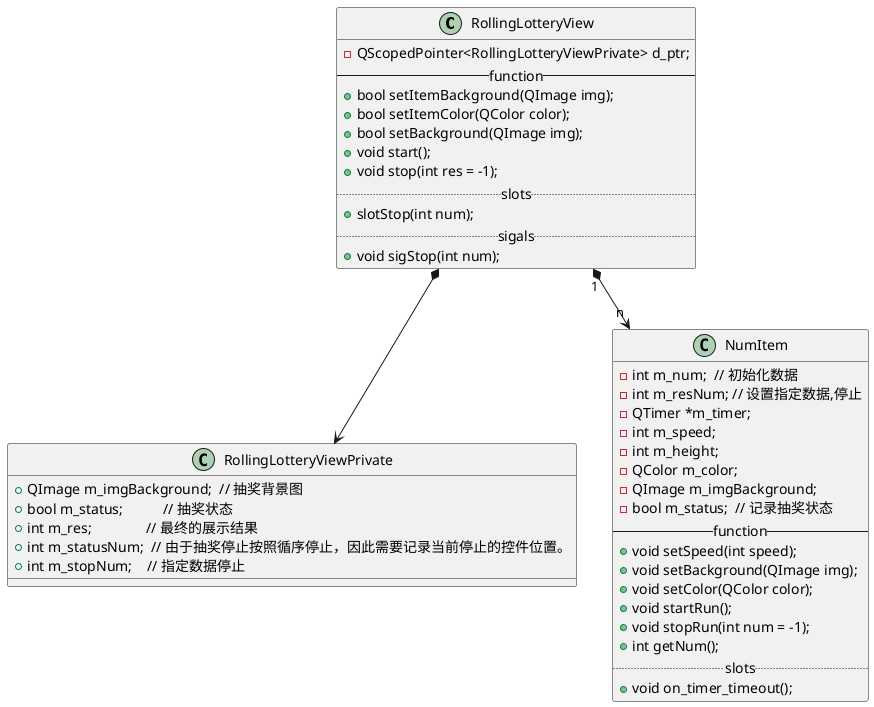
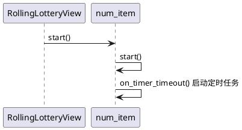
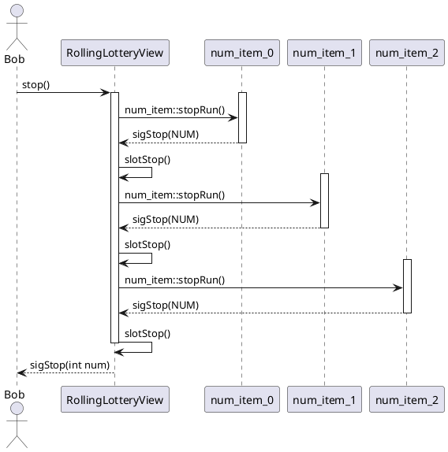

```plantuml
@startuml
class RollingLotteryView {
    - QScopedPointer<RollingLotteryViewPrivate> d_ptr;
    --function--
    + bool setItemBackground(QImage img);
    + bool setItemColor(QColor color);
    + bool setBackground(QImage img);
    + void start();
    + void stop(int res = -1);
    ..slots..
    + slotStop(int num);
    ..sigals..
    + void sigStop(int num);
}
class RollingLotteryViewPrivate {
    + QImage m_imgBackground;  // 抽奖背景图
    + bool m_status;           // 抽奖状态
    + int m_res;               // 最终的展示结果
    + int m_statusNum;  // 由于抽奖停止按照循序停止，因此需要记录当前停止的控件位置。
    + int m_stopNum;    // 指定数据停止
}
class NumItem {
    - int m_num;  // 初始化数据
    - int m_resNum; // 设置指定数据,停止
    - QTimer *m_timer;
    - int m_speed;
    - int m_height;
    - QColor m_color;
    - QImage m_imgBackground;
    - bool m_status;  // 记录抽奖状态
    --function--
    + void setSpeed(int speed);
    + void setBackground(QImage img);
    + void setColor(QColor color);
    + void startRun();
    + void stopRun(int num = -1);
    + int getNum();
   ..slots..
    + void on_timer_timeout();
}
RollingLotteryView *--> RollingLotteryViewPrivate
RollingLotteryView "1" *--> "n" NumItem
@enduml
```

```plantuml
@startuml
RollingLotteryView -> num_item : start()
num_item -> num_item:start()
num_item -> num_item:on_timer_timeout() 启动定时任务
@enduml

```

```plantuml
@startuml
actor Bob 
Bob -> RollingLotteryView : stop()
activate RollingLotteryView

activate num_item_0
RollingLotteryView -> num_item_0 : num_item::stopRun()
num_item_0 --> RollingLotteryView : sigStop(NUM)
deactivate num_item_0

RollingLotteryView -> RollingLotteryView:slotStop()


activate num_item_1
RollingLotteryView -> num_item_1 : num_item::stopRun()
num_item_1 --> RollingLotteryView :  sigStop(NUM)
deactivate num_item_1

RollingLotteryView -> RollingLotteryView:slotStop()

activate num_item_2
RollingLotteryView -> num_item_2 : num_item::stopRun()
num_item_2 --> RollingLotteryView : sigStop(NUM)
deactivate num_item_2
RollingLotteryView -> RollingLotteryView:slotStop()
deactivate RollingLotteryView

RollingLotteryView --> Bob: sigStop(int num)
@enduml

```